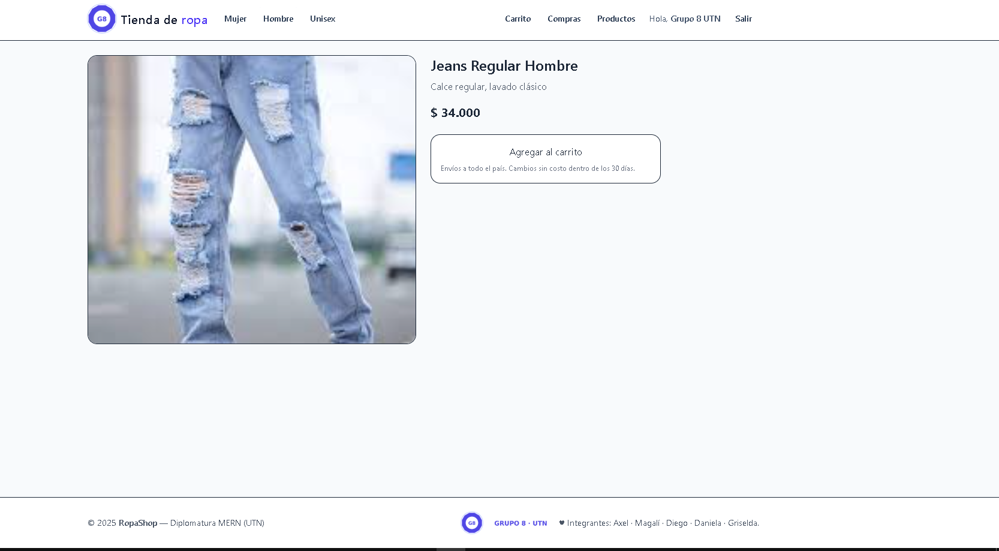
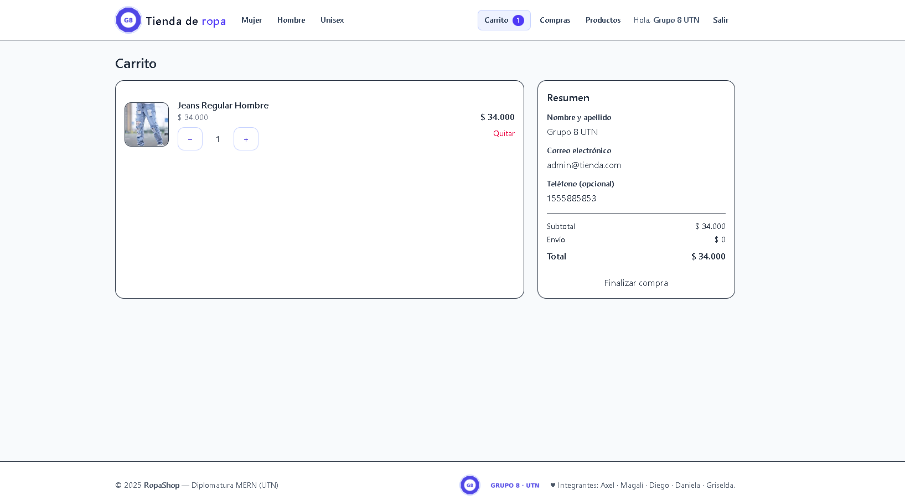
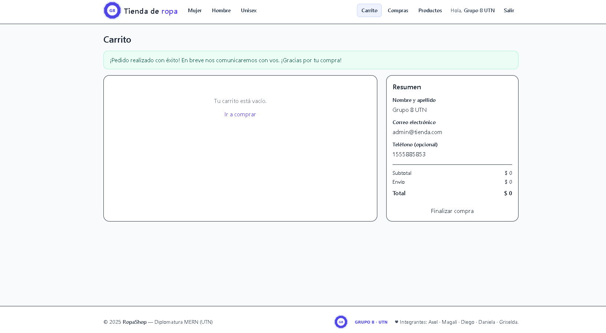
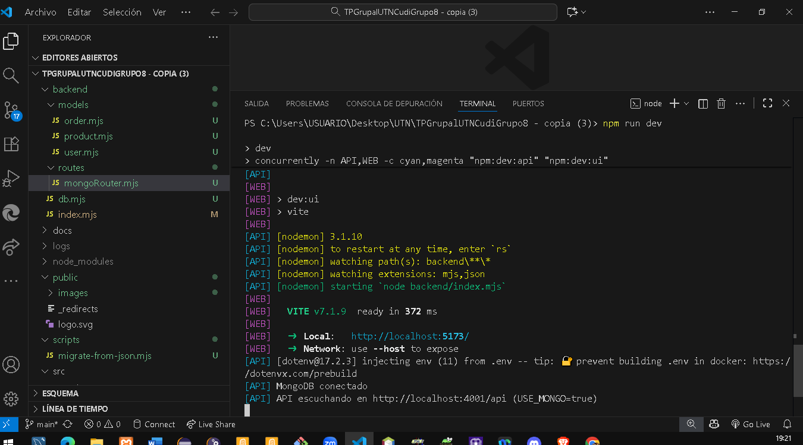

# Grupo 8 – UTN CUDI – Tienda (SPA + API)
### Diplomatura Desarrollo Web I – 2025

**Resumen:** Proyecto full‑stack con frontend SPA (Vite + React) y backend API (Node + Express). La **persistencia principal es MongoDB Atlas** vía Mongoose. Se mantiene un **modo alternativo JSON** solo para práctica/offline.

---

🚀 Demo en producción

Proyecto desplegado en Railway (Backend + Frontend integrados).
Usa MongoDB Atlas como base de datos principal (USE_MONGO=true).

🔗 App completa:
👉 https://grupo8utn2025-production.up.railway.app

🔗 API (endpoint de prueba):
👉 https://grupo8utn2025-production.up.railway.app/api/products

Permite probar el flujo completo:

Registro y login de usuarios

CRUD de productos (modo administrador)

Carrito y proceso de compra

Cambio de estado de órdenes

⚙️ Despliegue en producción (Railway + MongoDB Atlas)

Configuración de entorno para el servicio en Railway:

USE_MONGO=true
MONGO_URL=mongodb+srv://<usuario>:<password>@<cluster>/<nombreDB>?retryWrites=true&w=majority
FRONT_ORIGIN=https://grupo8utn2025-production.up.railway.app
CORS_ORIGIN=https://grupo8utn2025-production.up.railway.app
VITE_API_URL=https://grupo8utn2025-production.up.railway.app/api
JWT_SECRET=dev-super-secret
ADMIN_EMAIL=admin@tienda.com
LOG_ENABLED=true
MORGAN_FORMAT=dev
LOG_TO_FILE=false


Estado actual del deploy:

MongoDB conectado
API escuchando en http://localhost:8080/api (USE_MONGO=true)

---

## Tecnologías utilizadas
- **Frontend:** Vite + React
- **Backend:** Node.js + Express
- **Base de datos (principal):** MongoDB Atlas (Mongoose)
- **Autenticación:** JWT (signup/login), rol `admin` por `ADMIN_EMAIL`
- **Scripts:** Migración desde `db.json` a Mongo

---

## Comandos rápidos

| Tarea | Comando |
|------|---------|
| Instalar dependencias | `npm install` |
| Ejecutar en **Mongo (dev)** | `npm run dev` |
| Migración **simulada** (JSON→Mongo) | `npm run migrate:json:dry` |
| Migración **real** (JSON→Mongo) | `npm run migrate:json` |
| Build (si aplica) | `npm run build` |

---

## Configuración de entorno (`.env`)

> **Mongo es el modo principal.** Solo definí `MONGO_URL` y dejá `USE_MONGO=true`.

```env
USE_MONGO=true
MONGO_URL=mongodb+srv://<usuario>:<password>@<cluster>/<nombreDB>?retryWrites=true&w=majority
PORT=4001
FRONT_ORIGIN=http://localhost:5173
VITE_API_URL=http://localhost:4001/api
JWT_SECRET=dev-super-secret
ADMIN_EMAIL=admin@tienda.com
```

## Cómo correr el proyecto (Mongo — modo principal)

1. Crear `.env` con las variables de arriba (pegá tu `MONGO_URL` de Atlas).  
2. Instalar dependencias:
   ```bash
   npm install
   ```
3. Levantar entorno de desarrollo (API + Web):
   ```bash
   npm run dev
   ```
4. Verificar en consola del API:
   ```
   MongoDB conectado
   API escuchando en http://localhost:4001/api (USE_MONGO=true)
   ```
5. Navegar:
   - **Web**: `http://localhost:5173`
   - **API**: `http://localhost:4001/api/products`

---

## Migración de datos desde `db.json` → Mongo

- **Simulación (no escribe):**
  ```bash
  npm run migrate:json:dry
  ```
- **Migración real:**
  ```bash
  npm run migrate:json
  ```
Esto crea/actualiza colecciones `users`, `products`, `orders`.

---

## Modo alternativo JSON (opcional)

> Solo para práctica/offline. 

En `.env` podés conmutar:

```env
USE_MONGO=false
VITE_API_URL=http://localhost:4001/api
```

Luego `npm run dev`.

---

## 📷 Evidencias del funcionamiento (con MongoDB)

### 01. Sesión de usuario y admin


### 01c. Home


### 02. Registro y login


### 03. Productos por categoría


### 04. Alta/Edición y eliminación


### 05. Validaciones en creación de producto


### 06. Edición confirmada


### 07. Eliminación reflejada en listado


### 08. Carrito



### 09. Checkout



### 10. Compras (listado)


### 11. Cambios de estado


### 12. Compra manual


### 13. MongoDB conectado (modo principal)



---

## Credenciales de prueba

**Admin**
- Email: `admin@tienda.com`
- Password: `utn123`

**Usuario**
- Email: `griselmolina1970@gmail.com`
- Password: `Juan1970`

> Recordatorio: el rol admin se asigna al email configurado en `ADMIN_EMAIL` del `.env`.

---

## 📁 Estructura del Proyecto

A continuación se detalla la estructura principal del proyecto **Grupo8UTN2025**, organizada en frontend (SPA con React) y backend (API Node + Express + MongoDB), según lo trabajado en la Diplomatura UTN.

```text
Grupo8UTN2025/
├─ backend/                          🧠 Backend (API REST Node + Express)
│  ├─ db.mjs                         → Configuración de conexión a MongoDB (usa MONGO_URL, USE_MONGO)
│  ├─ index.mjs                      → Punto de entrada del servidor, rutas y modo JSON/Mongo
│  ├─ models/                        🧾 Modelos de datos (MongoDB + Mongoose)
│  │  ├─ order.mjs                   → Esquema y modelo de órdenes/compras
│  │  ├─ product.mjs                 → Esquema y modelo de productos
│  │  └─ user.mjs                    → Esquema y modelo de usuarios
│  └─ routes/
│     └─ mongoRouter.mjs             → Rutas de auth, productos y órdenes (modo Mongo principal)
│
├─ docs/                             📚 Documentación del proyecto
│  └─ capturas/                      🖼️ Capturas usadas en el README y defensa
│     ├─ 01-home.png
│     ├─ 01-consesion.png
│     ├─ 01-consesionadmin.png
│     ├─ 02-formregistro.png
│     ├─ 02-rta201logininmediato.png
│     ├─ 03-productoscategoriahombre.png
│     ├─ 03-productoscategoriamujer.png
│     ├─ 03-productoscategoriaunisex.png
│     ├─ 04-formautocompletadoparaeditar.png
│     ├─ 04-alertaeliminar.png
│     ├─ 04-formproductos-listado-crear.png
│     ├─ 05-crearproductocamposobligatorios.png
│     ├─ 06-editarproducto-200red.png
│     ├─ 06-editarproductorespuesta200red.png
│     ├─ 07-productoeliminarbermuda....png
│     ├─ 07-productoeliminadorespuestared.png
│     ├─ 07-desaparicionproductodellistado.png
│     ├─ 08-carrito.png
│     ├─ 08-productoagregadocarrito.png
│     ├─ 09-checkout.png
│     ├─ 09-comprafinalizada.png
│     ├─ 10-compraslistado.png
│     ├─ 11-cambioestadodesplegable.png
│     ├─ 11-red200.png
│     ├─ 12-modalcompramanual.png
│     ├─ 12-compramanualred201.png
│     └─ 13-mongidbconectado.png
│
├─ public/                           🌐 Archivos estáticos públicos
│  ├─ images/                        → Imágenes de productos por categoría (hombre/mujer/unisex)
│  │  ├─ hombre/...
│  │  ├─ mujer/...
│  │  └─ unisex/...
│  └─ vite.svg
│
├─ scripts/                          🛠️ Utilidades
│  └─ migrate-from-json.mjs          → Script para migrar datos de db.json a MongoDB
│
├─ src/                              💻 Frontend (SPA con React + Vite)
│  ├─ assets/
│  │  └─ react.svg
│  ├─ components/                    🔁 Componentes reutilizables
│  │  ├─ Footer.jsx                  → Pie de página
│  │  ├─ Navbar.jsx                  → Menú principal + links + sesión
│  │  ├─ Pagination.jsx              → Paginación de productos
│  │  └─ ProductCard.jsx             → Tarjeta de producto (imagen, precio, CTA)
│  ├─ context/                       🌍 Estado global
│  │  ├─ AuthContext.jsx             → Manejo de sesión, JWT, usuario logueado
│  │  └─ CartContext.jsx             → Manejo de carrito, totales, persistencia
│  ├─ hooks/                         🧩 Custom hooks
│  │  ├─ UseAuth.js                  → Hook para usar contexto de autenticación
│  │  └─ UseFetch.js                 → Hook para requests reutilizables
│  ├─ pages/                         📄 Vistas principales (rutas)
│  │  ├─ HomePage.jsx                → Landing / categorías destacadas
│  │  ├─ CategoriesPage.jsx          → Listado por categoría
│  │  ├─ ProductDetailPage.jsx       → Detalle de producto + agregar al carrito
│  │  ├─ CartPage.jsx                → Resumen de carrito + checkout
│  │  ├─ LoginPage.jsx               → Inicio de sesión
│  │  ├─ SignUpPage.jsx              → Registro de usuario
│  │  ├─ AdminProductsPage.jsx       → ABM de productos (solo admin)
│  │  ├─ AdminOrdersPage.jsx         → Gestión de órdenes (solo admin)
│  │                
│  ├─ services/                      🔌 Capa de APIs
│  │  ├─ api.js                      → Config base (VITE_API_URL, headers)
│  │  ├─ auth.js                     → Login, registro, perfil
│  │  ├─ products.js                 → CRUD de productos
│  │  ├─ orders.js                   → Órdenes de compra
│  │  └─ profile.js                  → Datos del usuario
│  ├─ styles/
│  │  └─ index.css                   → Estilos globales (Tailwind + ajustes)
│  ├─ App.jsx                        → Definición de rutas, layout general
│  └─ main.jsx                       → Punto de entrada React
│
├─ .env.example                      🔐 Ejemplo de configuración (.env no se versiona)
├─ .gitignore                        → Exclusión de .env, node_modules, logs, etc.
├─ db.json                           🗃️ Dataset base (modo JSON legacy / respaldo)
├─ index.html
├─ package.json
├─ package-lock.json
├─ README.md
├─ vite.config.json
└─ eslint.config.js

## 📋 Conclusión — Cumplimiento de consignas y teoría vista

Este proyecto integra de forma completa los contenidos teóricos y prácticos vistos durante la cursada de la Diplomatura UTN 2025, tanto en el **módulo Backend** como en el **módulo Frontend**.

### 🔹 Backend — Node.js + Express + MongoDB

El desarrollo del backend se ajusta a todas las consignas del **Trabajo Práctico Integrador Backend 2025**:

- **Arquitectura modular**: uso de carpetas `models/`, `routes/` y archivos de inicialización `db.mjs` e `index.mjs`, según la estructura enseñada en el curso.
- **Persistencia de datos**: implementación dual con `USE_MONGO` para alternar entre persistencia en **MongoDB Atlas** (modo principal) y **JSON local** (modo fallback).
- **Modelado de datos con Mongoose**: se definen esquemas `User`, `Product` y `Order` que reflejan las relaciones y validaciones necesarias.
- **Ruteo centralizado y middleware**: las rutas se concentran en `mongoRouter.mjs`, integrando controladores, validaciones y middleware de seguridad.
- **Variables de entorno**: el archivo `.env` y su plantilla `.env.example` gestionan credenciales, CORS, JWT y configuración de API, siguiendo las buenas prácticas vistas.
- **Migración de datos**: el script `migrate-from-json.mjs` automatiza el pasaje de datos entre persistencias, aplicando los conocimientos de CLI y manipulación de archivos.
- **Logs y entorno controlado**: se utiliza `dotenv`, `morgan` y flags de entorno (`LOG_ENABLED`, `MORGAN_FORMAT`) como parte del enfoque de observabilidad.

El backend demuestra dominio de los temas de **ruteo, middlewares, asincronismo, persistencia y validación de datos**.

---

### 🔹 Frontend — React + Vite + Tailwind

El frontend responde íntegramente a las consignas del **Trabajo Práctico Integrador Frontend 2025** y a la teoría de **componentización y manejo de estado global**:

- **SPA (Single Page Application)** desarrollada con React y Vite, con estructura organizada en `components/`, `pages/`, `context/`, `hooks/` y `services/`.
- **Consumo de API REST**: integración completa con el backend mediante `fetch` centralizado en `services/api.js`, respetando endpoints RESTful y métodos HTTP.
- **Gestión de estado global**: uso de Context API (`AuthContext` y `CartContext`) y custom hooks (`useAuth`, `useFetch`) que implementan los patrones vistos en clase.
- **Ruteo cliente**: navegación dinámica con `react-router-dom`, incluyendo rutas públicas, privadas y secciones de administrador.
- **Diseño responsivo y moderno**: uso de Tailwind CSS según la teoría de maquetado adaptativo; el proyecto mantiene coherencia estética y jerarquías visuales claras.
- **Formularios y validaciones**: implementación de formularios controlados para registro, login, carga y edición de productos.
- **Flujo completo de usuario y admin**: registro, login, navegación, compra, visualización de pedidos, CRUD de productos y gestión de órdenes.

El frontend demuestra los conocimientos de **React Hooks, composición de componentes, contexto global, estilos con Tailwind y consumo de APIs REST**.

---

### 🔹 Integración Fullstack

La aplicación combina ambos módulos en un ecosistema unificado:

- **Conexión fullstack**: `VITE_API_URL` enlaza el frontend (Vite) con el backend (Express).
- **Despliegue dual**: compatible con hosting combinado o independiente (Render + Vercel).
- **Migración entre modos**: el interruptor `USE_MONGO` permite cambiar de Mongo a JSON sin alterar la interfaz.

El resultado es un proyecto funcional, escalable y defendible, que refleja los conocimientos adquiridos y las prácticas recomendadas por la UTN.

---

✅ **Conclusión final:**  
El proyecto **cumple en su totalidad con los requerimientos del Trabajo Práctico Integrador Frontend y Backend 2025**, aplicando las tecnologías, buenas prácticas y conceptos teóricos vistos en la cursada (ruteo, asincronismo, validación, manejo de estado, consumo de APIs y persistencia en base de datos).


## Créditos

**Grupo 8 — Diplomatura Desarrollo Web I 2025 (UTN)**  
**Integrantes:** Axel Chamorro· Magalí Izaurralde· Diego Farías · Daniela Ávalos · Mauro Britez .Leandro Pinazo. Griselda Molina  
**Profesor:** Axel Leonardi